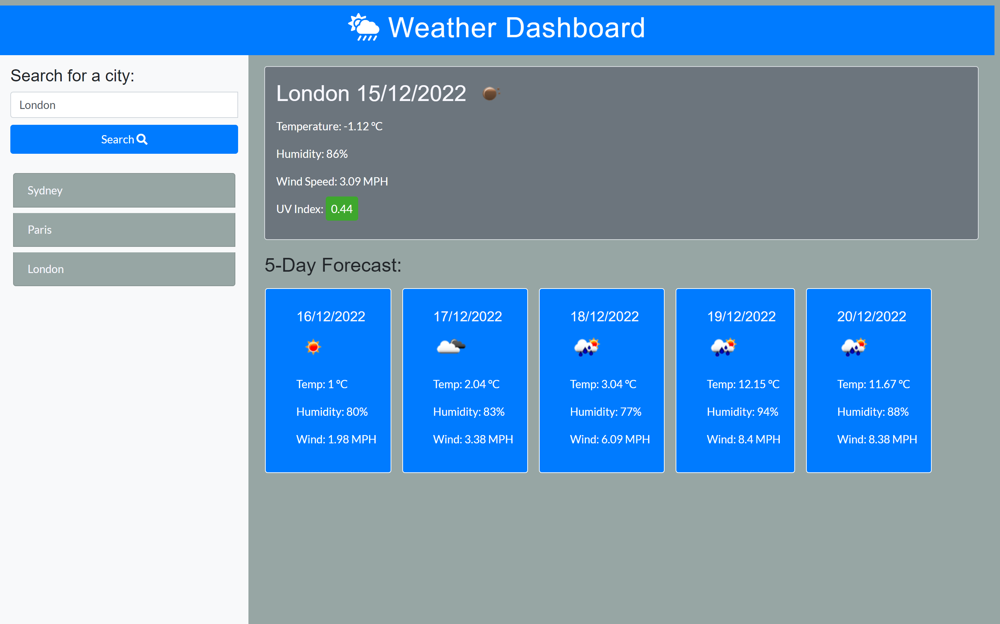

# Project Title: Weather-Dashboard
The weather outlook for multiple cities.

## Project Description:
This project presents a weather dashboard that will display the current day weather of the requested city. The weather details include temperature, humidity, wind speed and UV index. It also displays the next 5-day weather details. It lists the recently searched cities.

This application retrives data using the OpenWeather API. This app will run in any browser and feature dynamically updated HTML, a CSS framework (Bootstarp) and JavaScript, powered by jQuery. It is presented with a clean, polished, and responsive user interface. 

## Credits:
Thanks to Instructor Mahyar Mottaghi Zadeh for providing relevent training and rescources for this project.

## Website URL and Screenshots:

https://veerak21.github.io/weather-dashboard/

